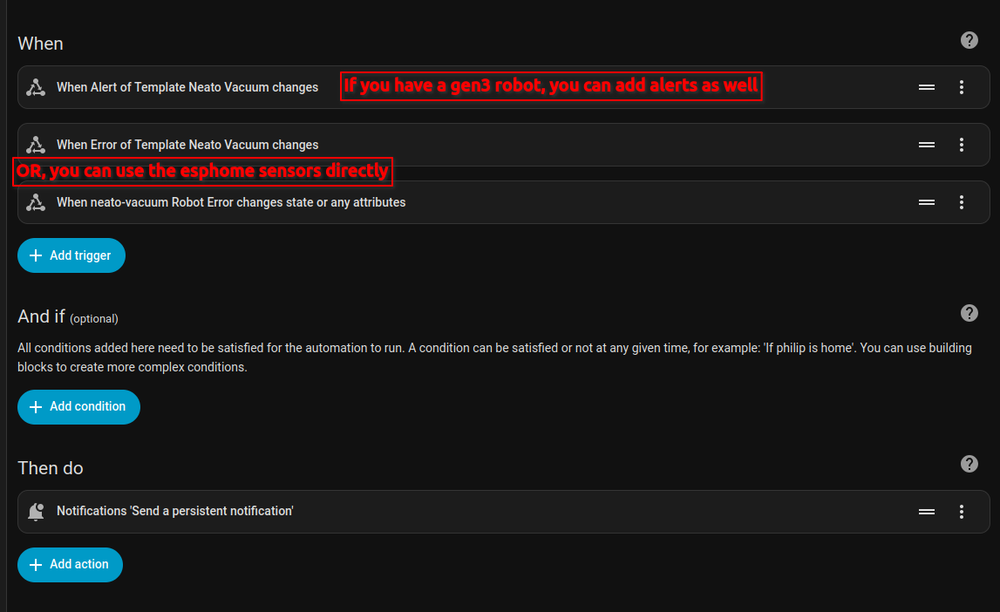

# Install with Home Assistant

My initial, and recommened, way to use this repair. All versions of this repair will be supported via this route, later versions should be much easier since I plan on making it all as one package on HACS. (ESPHome will probably still be required)


**Overview of steps:**
1. Setup HACS and install required add-ons
2. Import the config to ESPHome
3. Flash the image to your ESP device
4. Connect the ESP device to your robot
5. Add the ESP device to Home Assistant
6. Setup the Home Assistant card
7. Install the ESP device on the robot
8. Enjoy your locally connected robot!

I know this might be quite a bit overwhelming, but the reason there is this many steps is to have it as detailed as possible. Once again, at any point, feel free to ask for help!

## Step 1

We need to install certain add-ons to the home assistant installation to use all the features of this project.

### Home assistant add-ons
Donwload "ESPHome Device Builder" by
1. Going to `Settings` --> `Add-ons` --> `Add-on Store` --> `Open "ESPHome Device Builder"`.
    - [](https://my.home-assistant.io/redirect/supervisor_addon/?addon=5c53de3b_esphome&repository_url=https%3A%2F%2Fgithub.com%2Fesphome%2Fhome-assistant-addon)
2. Select install.
3. I would recommend to enable `Add to sidebar` and `Start on boot`. If you decide not to add it to the sidebar, you will need to open ESPHome by coming back to this page and selecting `Open web UI`.

### HACS
If you don't already have hacs, follow their guide to set it up: https://www.hacs.xyz/docs/use/. Once you have HACS setup, open it and install the following addons: (search with the id number!)
- `button-card` `146194325`
    - An button element to place on a dashboard with a lot of configurations to make the card look nice.
- `browser_mod` `194140521`
    - Allow for a popup when clicking on settings or holding down the spot clean button.
    - Don't forget to add the "Browser Mod" integration in Settings -> Devices & Services -> Add Integration or click this button: 
        - [](https://my.home-assistant.io/redirect/config_flow_start/?domain=browser_mod)
    - It will ask you if you want to register your browser as a device, you don't need to do this for it to work!

After installing these add-ons you need to refresh your page, however, some browsers need a hard refresh. This you can do by pressing `Ctrl + Shift + R`. If it still does not want to work you might need to restart Home Assistant.

## Step 2

### ESPHome Secrets
Open the ESPHome Builder and click the "Secrets" in the top right. Make sure your secrets include at the minimum this:
```yaml
# Generate at https://esphome.io/components/api/#api-key
neato_vacuum_api: "<API_KEY>"
# Generate at https://bitwarden.com/password-generator/
neato_vacuum_ota: "<OTA_PASSWORD>"

# Your Wi-Fi SSID and password
wifi_ssid: "<WIFI_SSID>"
wifi_password: "<WIFI_PASSWORD>"
```

Once you have filled this file with your values, save it, and make sure to never share this file if asking for support etc. Remove the `<>` charachers, there are used for marking a field of what you should replace.

If you want to add more devices, best practice is to set the api key and ota password in your secrets file. Your wifi password and ssid should also be kept here. Since the esp device will be strapped to, or inside the robot OTA (over the air) updates is quite important for this use case.

### Config file
Download the ESPHome config based on the generation of your robot:
- [`gen2`](https://github.com/philip2809/neato-connected/releases/latest/download/esphome_gen2.yaml)
- [`gen3`](https://github.com/philip2809/neato-connected/releases/latest/download/esphome_gen3.yaml)

Once back at the ESPHome main page, click the big green button in the bottom left to add a new device. Read the information, but for now, click "Continue" and either import the file you downloaded, or start with an empty configuration and paste the contents in. Open the file in edit mode in case it does not automatically open in edit mode.

**The following two steps might be hard to do, feel free to ask for help in the discord or discussions.**

Now, you will need to fill out some of the details in the configuration file, but the main parts is the platform type, pins for uart, name and ip settings if needed. If you are not using home assistant you will also need to configure the timezone platform. There is some additional help as comments in the configuration file.

For this uart pins, this is highly dependent on your board, both based on which ones you can easily connect too, but also what is supported on your platform. In some cases, the pins labeled `TX` and `RX` cannot be used, as these are used to upload the firmware, you will need to find GPIO pins that support using using UART, on the ESP32 many of the GPIO pins can be used. There is many tutorials for the different boards, here is some common ones:
- [ESP32](https://randomnerdtutorials.com/esp32-pinout-reference-gpios/)
- [ESP8266](https://randomnerdtutorials.com/esp8266-pinout-reference-gpios/)

## Step 3
Now you will need to build and flash the images onto your ESP device! While in the editor, press the "Install" button in the top right, since the device is not yet setup, select "Manual download", this will build the configuration file to an image you can flash, this might take a while on a fresh system, or not powerful hardware.

Once the image has been built, select to download in "Factory format", save this file on your computer and open [ESPHome Web](https://web.esphome.io/). Since this uses WebSerial you will need to use a chromium based browser. ESPHome has an amazing [guide](https://esphome.io/guides/physical_device_connection/) if this is your first time doing this, but to summerize, if you have an usb-port on your device, connect to it, if not you will need to connect to the `TX`, `RX`, `GND` and `3.3V/5V` with an TTY adapter. Then go into bootloader mode by pressing the "BOOT" button, if you don't have one, connect `GPIO0` to `GND`.

Once in ESPHome Web, connect your device to your computer, while going into bootloader mode, then select it in the list. Once selected, upload the firmware file you downloaded before and wait for it to finish.

Once the device has connected you need to verify that it works and you can see the web server it is hosting before we continue. For most people one of two links will bring you to the ESP device's web server:
- [`neato-vacuum.local`](http://neato-vacuum.local)
- [`neato-vacuum.lan`](http://neato-vacuum.lan)

**If you changed the name of your device in the config, these links will be different!**

If neither of these link work, please check that the device actually connected to your wifi and see if you can get the ip-address of the ESP device. If you are still having problems or have trouble finding the ip-address, feel free to ask for help!

## Step 4
When you have navigated to the site of the ESP device it should look something like this:


This is the webserver of the device. It will show up as not connected since we are not connected to the robot, we are only connected to a power source so that the ESP device can be configured. Now you can connect the device to the robot via the debug port to make sure that it works are you want to! To do this:
1. Turn the robot off
2. Take of the bumper of the robot
3. Connect to the robot - if you have an `gen2` robot, proceed to [the install guide](./install-esp-device-gen2.md)
    | Robot | ESP |
    |---|---|
    |RX|GPIO17|
    |3.3V|3.3V|
    |TX|GPIO16|
    |GND|GND|

    
4. Turn the robot back on, this should power up the ESP device and you can now go to the webserver interface page we saw before and the data from the robot should now show up!
    
5. Click the different buttons to make sure that it works, if you have a D3-D7, drive it around with the manual mode, however, remeber that the bumper is off!

## Step 5

After flashing and connecting the ESP device to the robot we need to add the ESP device into Home Assistant.
1. Power the robot on if it is off
2. In Home Assistant navigate to: `Settings` --> `Devices & Services` -- `Click "Add integration"` --> `Search "ESPHome"`
3. Enter the hostname or ip address of the ESPHome device
    - If you haven't change the name of the device in the config, it is most likely `neato-vacuum.local` or `neato-vacuum.lan` depending on your router. It is the same as the link that worked before in step 4.
    - If you want to use the ip address, find what ip the device got in your router. If you decide to use the ip, make sure to set it static!
4. Click submit and the device should be added.

## Step 6
Copy the contents of the Home Assistant card for your vacuum generation
- [`gen2`](https://github.com/philip2809/neato-connected/releases/latest/download/ha-card_gen2.yaml)
- [`gen3`](https://github.com/philip2809/neato-connected/releases/latest/download/ha-card_gen3.yaml)

**If you have changed the name in the ESPHome config:**
1. Paste the content into a text editor
2. Go to `Developer tools` --> `States` --> `In "Filter entities" search for "_fuel_percent"`
3. There should be a result for `sensor.<ENTITY_ID>_fuel_percent`
    - This entity id is probaly the same as the name you gave but lowercase and dashes changed for underscores.
4. Replace all instances of `neato_vacuum` with your `<ENTITY_ID>`


### Add the card
1. Press the pen icon in the top right on the desired dashboard
2. Press `Add card`
3. Scroll to the buttom and select `Manual`
4. Paste the contents of the card (if you changed the name, then the version that you changed)

### Vacuum Entity
You can also use neato-connected as an Home Assistant vacuum entity. The vacuum entity is needed in case you want to use any of the automations or scripts.


Sadly vacuum entities can only be added by editing the Home Assistant config files, however, I will walk though the entire proccess!
1. Going to `Settings` --> `Add-ons` --> `Add-on Store` --> `Open "File editor"`.
    - [](https://my.home-assistant.io/redirect/supervisor_addon/?addon=core_configurator&repository_url=https%3A%2F%2Fgithub.com%2Fesphome%2Fhome-assistant-addon)
2. Select install.
3. I would recommend to enable `Add to sidebar` and `Start on boot`. If you decide not to add it to the sidebar, you will need to come back here to open the file editor.
4. Open the file editor by clicking on "Open web UI" or if you added it to the sidebar, click on it in the sidebar.
5. Open the main `configuration.yaml` file by clicking on the folder icon in the top left then selecting the `configuration.yaml` file.
6. Add the following like to this config and then save by pressing the red save button in the top right or press `Ctrl + S`.
    ```yaml
    template: !include_dir_merge_list templates/
    ```
7. Click on the folder icon again and create a folder called `templates`.
8. Create a new file in this folder called `vacuums.yaml`.
9. Put the content of [`ha-vacuum-entity.yaml`] into this file
    - if you have multiple vacuums, duplicate the config from the `- name:` part and change the ids!
10. Save the file and make sure the configuration is good by going to `Developer tools` --> `YAML` --> `Click on "Check configuration"` --> `If configuration is good, click on "All YAML configuration" under "YAML configuration reloading"`.

### Schedule automation
Via Home Assistant you can also schedule your robot, this allows for smarter scheduling since this can check if someone is home (if setup of course), holidays etc. To set this up:
1. Go to `Settings` --> `Automations & Scenes` --> `Automations` --> Press the big blue `Create automation` in the bottom right corner
2. Press `Create new automation`
3. Add a trigger, for example that the vacuum should run every day at 08:00
4. Send an event to start the vacuum, either via the button esphome created **OR** via the vacuum entity you created


You can add as many triggers you want, any trigger added will cause the automation to run, and then you can add `And if` rules to make sure it is only tirggered when all conditions added there are meet.

### Notifications
Via Home Assistant you can also get notifications. For now with 1.2 the showcased notification system here is rudamentory, the notifications will be vastly improved with 1.3.
1. Go to `Settings` --> `Automations & Scenes` --> `Automations` --> Press the big blue `Create automation` in the bottom right corner
2. Press `Create new automation`
3. Add a trigger for when the robot error (and alert if you have a gen3 robot and want to) changes
4. Make it send a notification or a request to a notification service like unifiedpush.



For the notification, I would make the message:
```yaml
Alert: {{ state_attr('vacuum.template_neato_vacuum', 'alert') }}
Error: {{ state_attr('vacuum.template_neato_vacuum', 'error') }}
```

Remove the alert part in case you don't have a gen3 robot. You can also use the esphome sensor directly if you don't want to use the vacuum entity like: `{{ states('sensor.neato_vacuum_robot_error') }}`

## Step 7
**Before you make a permanent installation, make sure it all works via Home Assistant as you want it to!**

Now lets install the ESP device:
- [`gen2`](./install-esp-device-gen2.md)
- [`gen3`](./install-esp-device-gen3.md)

## Step 8
Now you can enjoy your locally controllable neato vacuum cleaner! Of course there is some quirks with this repair, however we feel they are worth the ability to regain functionality.
