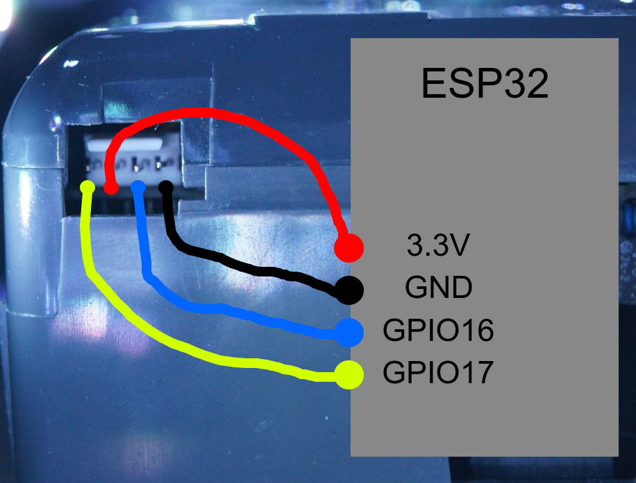

# Install without Home Assistant

You can also use this method without Home Assistant, however only version 1 will be supported for this route, since later versions will require a docker container with [ros2](https://www.ros.org/) for the floormap functions.

# TODO: add images

**Overview of steps**
1. Flash ESP device with prebuild images
2. Connect to robot
3. Configure wifi
4. Make sure it works
5. Fix ESP device inside or outside robot
6. Enjoy a locally connected vacuum & how to install updates

### Step 1
I have made some prebuilt images for reccomended ESP32s, however, if you have another ESP32 that is not listed here, ask me and I will build you one!
# TODO: add links
- ESP32
- ESP32-S3
- ESP32-C3

**If your ESP device does not have GPIO 17 and 16, please ask me for a build!**

**If you have multiple vacuums you will need prebuild images with different names or it will be annoying to connect to them, please ask for me for a build!**

The image you just downloaded by clicking on the link above is a so called factory image, it is a full "factory" firmware image, different from OTA (Over the air) update images. Later on when updates are released, you will only need to download and upload the ota-images, but this will be covered in step 7. 

Now that you have the image you need to flash this. The easiest way to do this is via [ESPHome Web](https://web.esphome.io/). Since this uses WebSerial you will need to use a chromium based browser, Google Chrome, Microsoft Edge or Chromium (basically anything that is not Firefox or Safari). ESPHome has an amazing [guide](https://esphome.io/guides/physical_device_connection/) if this is your first time doing this, but to summerize, if you have an usb-port on your device, connect to it, if not you will need to connect to the `TX`, `RX`, `GND` and `3.3V/5V` with an TTY adapter. Then go into bootloader mode by pressing the "BOOT" button, if you don't have one, connect `GPIO0` to `GND`.

Once in ESPHome Web, connect your device to your computer, while going into bootloader mode, then select it in the list. Once selected, upload the firmware file you downloaded before and wait for it to finish.

With the device still connected to your computer, go to the wifi settings of your computer or phone and connect to the network hosted by the esp device.
- SSID: `Neato-ESPHOME`
- Password: `make-it-suck-again`

Once you have connected your browser should automatically open a window to "login" to the network, you may need to see your notifications on the phone or open the web browser on a computer, but if none of that works, go to [`http://192.168.4.1/`](http://192.168.4.1/) manually. 

When you are on this site you should see the default captive portal that looks like this:

Now you will need to select and enter your wifi details so that the ESP device can connect to it. When you hit save, it will restart and connect to your wifi, if you entered your details incorrectly or it could not connect, the network you just connected to, `Neato-ESPHOME` should show up once again in your wifi settings so you can try again.

Once the device has connected you need to verify that it works and you can see the web server it is hosting before we continue. For most people one of two links will bring you to the ESP device's web server:
- [`neato-vacuum.local`](http://neato-vacuum.local)
- [`neato-vacuum.lan`](http://neato-vacuum.lan)

If neither of these link work, please check that the device actually connected to your wifi and see if you can get the IP address of the ESP device. If you are still having problems or have trouble finding the IP address, feel free to ask for help.

### Step 4
When you have navigated to the site of the ESP device it should look something like this:
# todo: add image

This is the webserver of the device. It will show up as not connected since we are not connected to the robot, we are only connected to a power source so that the ESP device can be configured. Now you can connect the device to the robot via the debug port to make sure that it works are you want to! To do this:
1. Turn the robot off
2. Take of the bumper off the robot
3. Connect to the robot
    | Robot | ESP |
    |---|---|
    |RX|GPIO17|
    |3.3V|3.3V|
    |TX|GPIO16|
    |GND|GND|

    
4. Turn the robot back on, this should power up the ESP device and you can now go to the webserver interface page we saw before and the data from the robot should now show up.
    # todo: add image
5. Click the different buttons to make sure that it works, if you have a D3-D7, drive it around with the manual mode, however, remember that the bumper is not attached.

### Step 5

Once you are ready for the permanent installation, go here: [Permanent installation](./install-internally.md)

### Step 6
Now you can enjoy your locally controllable neato vacuum cleaner.

Eventually there will be updates, either as new features or stability fixes, however all of this connecting and flashing will no longer be required since ESPHome have support for OTA-updates. To update when a new version comes out, you will need to:
1. Download the OTA update file from (github releases)[add link]
2. 
    Downloads for reccomended ESP32 devices is here:
    # TODO: add links
    - ESP32
    - ESP32-S3
    - ESP32-C3
3. Go to the webserver of the device and upload the file under the OTA section
    # TODO: add image
4. Wait for it to update and restart then refresh the page, you should now be on the latest version!

